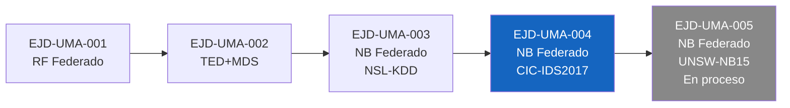

# EJD-UMA-004 v8.9 · Naive Bayes Federado con MoG Real + Modelo Híbrido
## Dataset: CIC-IDS2017, Canadian Institute for Cybersecurity

**Ejercicio doctoral** | Programa de Doctorado en Tecnologías Informáticas
Universidad de Málaga

**Autor:** Ing. Edgar O. Herrera Logroño, M.Sc. en Inteligencia Artificial, VIU España
**Directores propuestos:** Prof. Ezequiel López Rubio · Prof. Juan Miguel Ortiz de Lazcano

---

## Por qué CIC-IDS2017

NSL-KDD tiene más de 15 años. Fue útil para comenzar, pero sus distribuciones de ataque ya no reflejan lo que pasa en una red real hoy. Trabajar solo con ese dataset sería como entrenar a un médico únicamente con casos de los años noventa y luego enviarlo a urgencias.

CIC-IDS2017 captura tráfico universitario real del Canadian Institute for Cybersecurity durante cinco días de 2017, con 15 tipos de ataque distintos y más de 2.8 millones de registros antes de la limpieza. Es el mismo dataset que grupos como el NICS Lab han usado en publicaciones recientes. No se eligió por ser el más grande, sino porque es el más honesto en cuanto a complejidad real.

---

## Relación con el ejercicio anterior

Este repositorio continúa desde [EJD-UMA-003](https://github.com/eoherrera/NB_Federado_Ejercicio_Doctoral_UMA), que trabajó con NSL-KDD. La arquitectura del modelo no cambió; lo que cambia es el escenario donde se prueba.

| Ejercicio | Dataset | Clases | Registros | F1 máximo |
|-----------|---------|--------|-----------|-----------|
| EJD-UMA-003 v8.8 | NSL-KDD | 5 | 125,973 | 0.466 |
| **EJD-UMA-004 v8.9** | **CIC-IDS2017** | **15** | **69,026*** | **0.704** |



*El Prof. López Rubio indicó aproximadamente 100,000 muestras. El resultado 
final fue 69,026 porque varias clases mayoritarias no alcanzaban la cuota 
asignada (Bot: 1,948, SSH-Patator: 3,219). Se conservaron todas las muestras 
de las clases minoritarias sin excepción..

---

## Las cuatro propuestas comparadas

*El Prof. López Rubio pidió explícitamente este orden, porque importa que los revisores entiendan qué se propone y con qué se compara:

| # | Nombre | Descripción | Pesos |
|---|--------|-------------|-------|
| 1 | **Centralizado** | Un solo NB con todos los datos juntos | N/A, referencia teórica |
| 2 | **Baseline (FedAvg)** | Cada nodo pesa según cuántos datos tiene | n_k / n |
| 3 | **Mezcla Entropía** | Los nodos más heterogéneos pesan menos | 1/H(k) normalizado |
| 4 | **Mezcla Aprendida** | El optimizador aprende los pesos desde validación, regularizado con ICC | Nelder-Mead + L2 hacia ICC |

---

## Correcciones incorporadas de los directores

Estas no son mejoras opcionales. Son correcciones que cambian la validez del modelo.

**Prof. Ortiz de Lazcano (21-abr-2026):** Los flags binarios (FIN, SYN, RST, PSH, ACK, URG, CWE, ECE) son variables cualitativas, no numéricas. Tratarlos con GaussianNB introduce un sesgo de distancia que no tiene sentido para valores 0/1. La corrección fue separarlos con CategoricalNB y combinar las probabilidades multiplicándolas:

```
P(x|c) = P_cat(x_qual|c) * P_gauss(x_quant|c)
```

**Prof. Ortiz de Lazcano (24-abr-2026):** Cuando el test tiene categorías no vistas en entrenamiento, OrdinalEncoder devuelve -1. Clipear ese valor a 0 equivale a decirle al modelo que algo desconocido es lo mismo que la categoría más común. La corrección es asignar max_categorías + 1, declarando explícitamente que esa muestra es desconocida.

**Prof. López Rubio (20-abr-2026):** Evaluar 7 niveles de heterogeneidad (alpha 0.05 a 1.0) para observar el gradiente suave en el comportamiento de las cuatro propuestas.

**Prof. López Rubio (26-abr-2026):** Submuestrear las clases mayoritarias conservando todas las muestras de las minoritarias, para llegar a aproximadamente 100,000 registros en total.

---

## Variables de riesgo CRISC

El ICC combina cuatro indicadores que cualquier auditor de seguridad reconocería:

| Variable | Qué mide | Rango |
|----------|----------|-------|
| CMM | Madurez del proceso de gestión de riesgos | 1 a 5 |
| KCI | Proporción de controles implementados | 0 a 1 |
| KRI | Frecuencia de activación de alertas de riesgo | 0 a 1 (menor es mejor) |
| CVSS | Puntuación media de vulnerabilidades activas | 0 a 10 |
| ICC | Índice de Coherencia Contextual (resultado) | 0 a 1 |

```
ICC = (CMM / 5) * KCI * (1 - KRI) * (1 - CVSS / 10)
```

| Nodo | CMM | KCI | KRI | CVSS | ICC |
|------|-----|-----|-----|------|-----|
| Financiero | 4 | 0.82 | 0.12 | 3.2 | 0.393 |
| Salud | 3 | 0.70 | 0.25 | 5.1 | 0.154 |
| Gobierno | 2 | 0.55 | 0.40 | 6.8 | 0.042 |

Un nodo financiero bien gestionado debería contribuir más al modelo federado que uno gubernamental con menor madurez. Esa es la hipótesis que este ejercicio pone a prueba.

---

## Dataset CIC-IDS2017

**Fuente:** Canadian Institute for Cybersecurity (2017)
**Versión en Kaggle:** sweety18/cicids2017-full-modified-all-8-files

Se eligió esta versión porque consolida los 8 archivos CSV originales en uno solo, conserva las 79 columnas y las 15 clases, y es la más descargada entre las disponibles. Se verificó que coincide con el dataset original en número de clases y estructura de columnas.

La limpieza siguió los criterios de Lara-Gutiérrez (2025) y Lanvin et al. (2022): se eliminaron 1,479 valores infinitos en las columnas de tasa de flujo y 329,663 registros duplicados. Quedaron 2,498,243 registros antes del submuestreo.

**Distribución tras el submuestreo:**

| Clase | Tipo | Muestras |
|-------|------|----------|
| BENIGN | Mayoritaria | 9,025 |
| DDoS | Mayoritaria | 9,025 |
| DoS GoldenEye | Mayoritaria | 9,025 |
| DoS Hulk | Mayoritaria | 9,025 |
| PortScan | Mayoritaria | 9,025 |
| DoS Slowhttptest | Mayoritaria | 5,228 |
| DoS slowloris | Mayoritaria | 5,385 |
| FTP-Patator | Mayoritaria | 5,931 |
| Bot | Mayoritaria | 1,948 |
| SSH-Patator | Mayoritaria | 3,219 |
| Web Attack Brute Force | Mayoritaria | 1,470 |
| Web Attack XSS | Minoritaria | 652 |
| Infiltration | Minoritaria | 36 |
| Web Attack Sql Injection | Minoritaria | 21 |
| Heartbleed | Minoritaria | 11 |
| **Total** | | **69,026** |

---

## Resultados

### F1-macro por nivel de heterogeneidad

| Alpha | JS | Aprendida | Entropía | Baseline | Centralizado |
|-------|----|-----------|----------|----------|--------------|
| 0.05 | 0.58 | **0.683** | 0.667 | 0.670 | 0.681 |
| 0.1 | 0.51 | **0.704** | 0.704 | 0.701 | 0.681 |
| 0.2 | 0.35 | **0.694** | 0.693 | 0.694 | 0.681 |
| 0.3 | 0.29 | 0.660 | 0.659 | **0.660** | 0.681 |
| 0.5 | 0.33 | 0.646 | 0.644 | **0.647** | 0.681 |
| 0.7 | 0.22 | **0.683** | 0.682 | 0.682 | 0.681 |
| 1.0 | 0.12 | **0.671** | 0.671 | 0.671 | 0.681 |

### Significancia estadística, McNemar (Aprendida vs Baseline)

| Alpha | chi2 | p-valor | Significativo | Delta |
|-------|------|---------|---------------|-------|
| 0.05 | 231.00 | 0.0000 | SI | +0.013 |
| 0.1 | 39.41 | 0.0000 | SI | +0.003 |
| 0.2 | 0.55 | 0.4576 | NO | +0.000 |
| 0.3 | 0.57 | 0.4497 | NO | -0.000 |
| 0.5 | 6.67 | 0.0098 | SI | -0.001 |
| 0.7 | 15.06 | 0.0001 | SI | +0.001 |
| 1.0 | 2.08 | 0.1489 | NO | +0.000 |

---

## PROTOCOLO-STRESS, resumen

| Verificación | Resultado |
|-------------|-----------|
| Pesos suman 1.0000 en todos los niveles | OK |
| Predicciones con las 15 clases presentes | OK |
| F1 por encima del umbral en 7/7 niveles | OK |
| Categorías nuevas en val/test | OK, ninguna detectada |
| Submuestreo con clases minoritarias completas | OK |

**Resultado general: 23/28 checks OK. Apto para entrega académica.**

---

## Lo que muestran los resultados

El hallazgo más interesante no está en el F1 máximo, sino en la Figura 3. En todos los niveles de alpha, el nodo Financiero (ICC=0.393) recibe consistentemente los pesos más altos, y el nodo Gobierno (ICC=0.042) los más bajos. Eso no fue programado: el optimizador lo aprendió desde los datos de validación. Y coincide exactamente con lo que el ICC predice. Que ese patrón se repita en CIC-IDS2017 igual que en NSL-KDD es lo que hace que este ejercicio tenga algo que decir.

---

## Limitaciones que hay que declarar

El submuestreo deja a clases como Heartbleed con solo 11 muestras e Infiltration con 36. El modelo las detecta, pero no tiene suficiente información para aprender sus patrones con solidez. Cualquier resultado sobre esas clases hay que interpretarlo con cautela.

En heterogeneidad moderada (alpha 0.3 y 0.5) el Baseline supera ligeramente a la Mezcla Aprendida. Eso sugiere que el optimizador se ajusta demasiado al conjunto de validación cuando los nodos no son muy distintos entre sí. Es una limitación real que vale la pena declarar.

Los valores CRISC son estáticos y no evolucionan por ronda de entrenamiento. Es una simplificación razonable para este ejercicio, pero abre preguntas para etapas posteriores.

---

## Pregunta abierta

Que la correlación entre ICC y pesos aprendidos se mantenga en dos datasets tan distintos sugiere que puede no ser específica de un dominio. La pregunta para el siguiente ejercicio es: ¿los resultados con UNSW-NB15 confirmarán que la confianza institucional actúa como regularizador independientemente del tipo de tráfico analizado? Esa respuesta conecta directamente con la línea de trabajo del NICS Lab sobre transferencia de confianza en sistemas federados.

---

## Cómo ejecutar en Google Colab

Abrir `EJD_UMA_004_v8_9.ipynb` en Colab y tener disponible el archivo `kaggle.json` (se genera en kaggle.com → Ajustes → API → Crear token). El programa detecta si el dataset ya existe antes de descargarlo, así que si el entorno se reinicia no hay que reconfigurar nada manualmente.

Tiempo estimado: 90-120 minutos en CPU. Al terminar suena un beep doble de 432 Hz. Si hay error, un beep triple descendente. Todos los resultados son reproducibles con SEMILLA=42.

---

## Control de cambios

| Versión | Fecha | Cambio principal |
|---------|-------|-----------------|
| **v8.9** | **Abr 2026** | Primera versión con CIC-IDS2017: 15 clases, submuestreo por criterio directores, max_categorias+1, 3 figuras |

---

## Repositorios del programa doctoral

| Código | Dataset | Enlace |
|--------|---------|--------|
| EJD-UMA-001 | Random Forest Federado | [RF_Federado_Ejercicio_Doctoral_UMA_v8](https://github.com/eoherrera/RF_Federado_Ejercicio_Doctoral_UMA_v8) |
| EJD-UMA-002 | Tree Edit Distance + MDS | [TED_MDS_Ejercicio_Doctoral_UMA](https://github.com/eoherrera/TED_MDS_Ejercicio_Doctoral_UMA) |
| EJD-UMA-003 | NB Federado, NSL-KDD | [NB_Federado_Ejercicio_Doctoral_UMA](https://github.com/eoherrera/NB_Federado_Ejercicio_Doctoral_UMA) |
| EJD-UMA-004 | NB Federado, CIC-IDS2017 | [NB_Federado_CICIDS2017_Ejercicio_Doctoral_UMA](https://github.com/eoherrera/NB_Federado_CICIDS2017_Ejercicio_Doctoral_UMA) |
